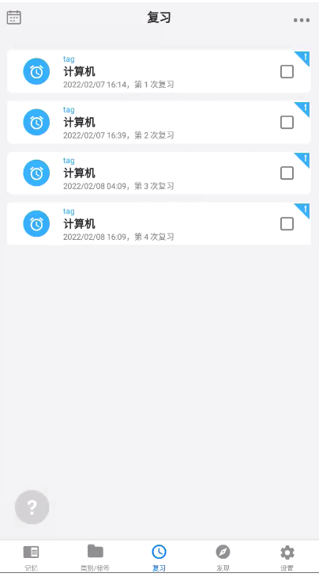

# 前端

> vue3  
> h5 + pc + 微信小程序

1. vue-cli
2. vue-router
3. 组件库

- h5/微信小程序: [taro](https://github.com/nervjs/taro)
- pc: [element-plus](https://github.com/element-plus/element-plus)

4. 后台管理: [vue-vben-admin](https://github.com/vbenjs/vue-vben-admin)

5less or sass

5. ts & eslint & style lint?
6. prettier 格式化代码
7. webpack

# 后端

1. nginx
2. docker
3. mysql
4. fastAPI
5. redis
6. es?
7. cnd

# 表结构

1. 用户表:

| ID       | 用户名        | 邮箱             | 密码密文 | 手机号 |
| -------- | ------------- | ---------------- | -------- | ------ |
| 雪花算法 | 必须 可以修改 | 需要验证(验证码) | 哈希加密 | 可选   |

> 登录时 账户为邮箱或手机号

2. 标签表

| ID  | UID | 名称 | 图标 | 颜色 |
| --- | --- | ---- | ---- | ---- |

3. 卡片表

| ID  | UID | TagID | 名称 | 创建时间 | 简要概要 | 详细内容(md) |
| --- | --- | ----- | ---- | -------- | -------- | ------------ |

4. 复习计划表

| ID  | UID | 名称 | 复习时间 |
| --- | --- | ---- | -------- |

自带默认

| ID  | UID  | 名称     | 复习时间(单位 s)                                       | 备注             | 需要时间 |
| --- | ---- | -------- | ------------------------------------------------------ | ---------------- | -------- |
| 1   | null | 标准模式 | 30min-1 日-2 日-4 日-7 日-15 日-1 月                   | 根据百度百科而来 | 59day    |
| 2   | null | 单次复习 | 1 时                                                   | 适用于单次复习   | 0day     |
| 3   | null | 超级复习 | 2 时-1 日-1 日-1 日-1 日-1 日-1 日-1 日-1 日-1 日-1 日 | 高强度复习       | 10day    |
| 4   | null | 超级复习 | 30min-1 日-2 日-3 日-5 日-8 日-15 日-1 月-1 月-1 月    | 改良版的复习计划 | 95day    |

5. 要复习的计划表

| ID  | UID | CID(卡片 ID) | 复习计划 ID | 已经复习的时间 | 下一次复习的时间 |
| --- | --- | ------------ | ----------- | -------------- | ---------------- |

# 功能分析

1. 用户首页为复习页面
    - 复习页面  
      
    - 需要数据当前要复习的卡片数据
    -

# 接口

## 卡片相关

### 获取全部卡片

`GET /cards`

请求:

```json
{
  "tag": "python",
  //  取多少条数据
  "limit": 10,
  //  跳过多少条数据
  "offset": 0
}
```

响应:

```json
{
  "status": 1,
  "msg": "success",
  "data": [
    {
      //  卡片ID
      "id": 1,
      //  卡片名称
      "title": "xxx速记",
      //  复习时间
      // datetime
      "reviewDate": "2021-12-12 13:01:21",
      //  是否星标
      "isStar": true,
      "tag": {
        //  卡片所属标签ID
        "id": 2,
        //  卡片所属标签名
        "name": "python",
        //  卡片图标
        "icon": "iconfont",
        // 卡片标签颜色
        "color": "#123456"
      }
    }
    // ...
  ]
}
```

### 获取单个卡片

`GET /cards/{cid}`

```json
{
  "status": 1,
  "msg": "success",
  "data": {
    //  卡片ID
    "id": 1,
    //  卡片名称
    "title": "xxx速记",
    //  复习时间
    // datetime
    "reviewDate": "2021-12-12 13:01:21",
    "summary": "概要信息, 用于提示",
    "description": "详细信息, md格式",
    //  是否星标
    "isStar": true,
    "tag": {
      //  卡片所属标签ID
      "id": 2,
      //  卡片所属标签名
      "name": "python",
      //  卡片图标
      "icon": "iconfont",
      // 卡片标签颜色
      "color": "#123456"
    }
  }
}
```

### 创建卡片

`POST /cards`

请求:

| 名称   | 标签 ID | 复习计划 ID | 简要概要(提示内容) | 详细内容(md) |
| ------ | ------- | ----------- | ------------------ | ------------ |
| string | int     | int         | string             | string       |

### 修改卡片

`POST /cards/{cid}`

请求:

| 名称   | 标签 ID | 复习计划 ID | 简要概要(提示内容) | 详细内容(md) |
| ------ | ------- | ----------- | ------------------ | ------------ |
| string | int     | int         | string             | string       |

## 复习相关

### 获取需复习的全部卡片

`GET /review`

请求:

```json
{
  "tag": "python",
  //  取多少条数据
  "limit": 10,
  //  跳过多少条数据
  "offset": 0
}
```

响应:

```json
{
  "status": 1,
  "msg": "success",
  "data": [
    {
      //  卡片ID
      "id": 1,
      //  卡片名称
      "title": "xxx速记",
      //  复习时间
      // datetime
      "reviewDate": "2021-12-12 13:01:21",
      //  是否星标
      "isStar": true,
      "tag": {
        //  卡片所属标签ID
        "id": 2,
        //  卡片所属标签名
        "name": "python",
        //  卡片图标
        "icon": "iconfont",
        // 卡片标签颜色
        "color": "#123456"
      }
    }
    // ...
  ]
}
```

### 完成复习

`POST /review/{cid}`

请求:  
无

响应:

```json
{
  "status": 1,
  "msg": "已完成"
}
```

## 标签相关

### 获取全部标签

`GET /tags`  
请求:

```json
{
  //  取多少条数据
  "limit": 10,
  //  跳过多少条数据
  "offset": 0
}
```

响应:

```json
{
  "status": 1,
  "msg": "success",
  "data": [
    {
      //  标签ID
      "id": 2,
      //  标签名称
      "name": "python",
      //  标签图标
      "icon": "iconfont",
      // 标签颜色
      "color": "#123456",
      //  是否星标
      "isStar": true,
      // 该标签的全部卡片数
      "cardsCount": 10
    }
    // ...
  ]
}
```

> 通过`GET /cards`返回指定 tag 的所有卡片

# TODO:

使用 webdav 同步数据
